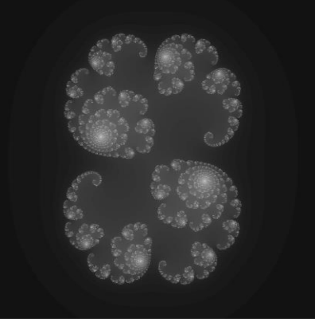

# A6 (15 marks + 5 bonus marks)
## Focus: CUDA (C) – Thread Organization

This assignment aims to compute the normal Julia set that can be represented in an image similar to the one provided below:

1. Download A6*serial.zip from Canvas. The provided code uses the open-source EasyBMP1 library for writing images. Unzip the file and read the copyright note BSD*(revised)\_license.txt.
2. Move the unzipped files into a new VS project – for example, use the method described in VS2019MultiProjectSolution.pdf
3. Compile and run Julia_set_serial.cu.
    - Note: the program was created in Visual Studio 2015. To open and run in Visual Studio, double click A6.sln then compile and run Julia_set_serial.cu. If you are using a different IDE, use the files under the subfolder A6.
4. Check the output bmp image named test.bmp (under subfolder A6). It should be similar to the one on the right (the grayscale).
5. Familiarize yourself with the code in Julia_set_serial.cu. Comments are provided in order to explain how the code works. There is no need to read the code in the other files.
    - Optional: See the extra information provided at the end of this question.

Submit:
- CUDA implementation that performs the same computation as the given code using 1 thread per pixel. (see the comments in Julia_set_serial.cu for the part that needs to be parallelized).
- The output image from your CUDA code in BMP format.

Marking guide:
- +2 marks for properly declaring the functions
- +4 for kernel launch configuration
- +2 for getting the right pixel location and assigning one thread per pixel
- +3 for allocating, copying, and freeing device memory
- +1 for submitting the output image with a proper Julia set.
- +3 for overall correctness

BONUS: up to +5 bonus marks for modifying your code in order to set different colors to the pixels with the different values in the Julia set (especially at the boundaries). See the example on the right although your image doesn’t have to match this one.

More information about the used algorithm: (you don’t need to fully understand this part in order to solve the question): The Julia set in the question is computed using the function ��(��) = ��^2 + ��. Both z and c are complex numbers, where the real and imaginary values are represented on the x-y axis. The code computes a 1024x768 matrix storing the image corresponding to the complex plane. Other Julia sets can be generated by changing the value of c in the function ��(��) = ��^2 + ��. See http://en.wikipedia.org/wiki/Julia_set

1 The full EasyBMP library and samples can be downloaded from easybmp.sourceforge.net. You don’t need the full library as the required files are already attached to this assignment.

## Submission Instructions
For this assignment, you need to do the following:
1. Compress all your files (the source code and the image) into one zip file and give it a name that matches your ID (e.g., 1234567.zip).
2. Submit the zipped file to Canvas.

Note that you can resubmit an assignment, but the new submission overwrites the old submission and receives a new timestamp.
